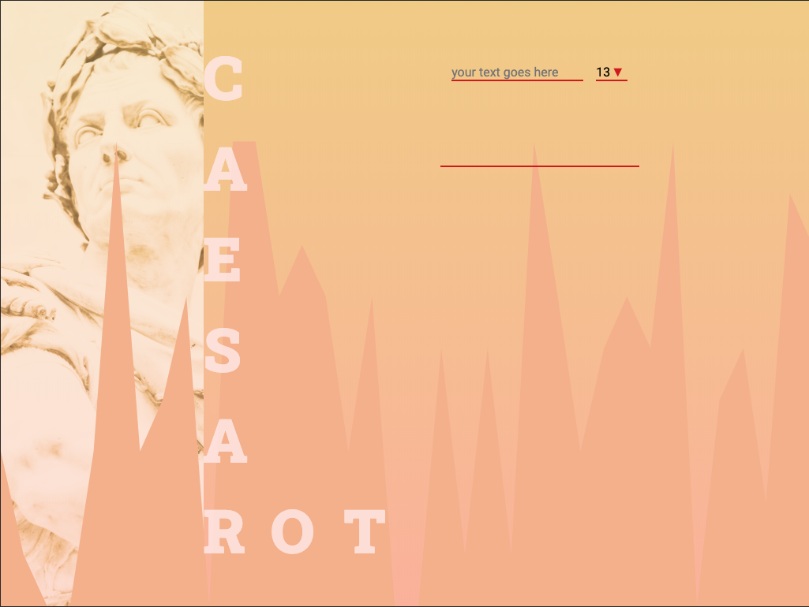

# Caesar cipher ROT13

In cryptography, a Caesar cipher, also known as Caesar's cipher, the shift cipher, Caesar's code or Caesar shift, is one of the simplest and most widely known encryption techniques. It is a type of substitution cipher in which each letter in the plaintext is replaced by a letter some fixed number of positions down the alphabet. For example, with a left shift of 3, D would be replaced by A, E would become B, and so on. The method is named after Julius Caesar, who used it in his private correspondence.
_[Wikipedia](https://en.wikipedia.org/wiki/Caesar_cipher)_

## Website 🚀

[go to the website](https://caesar13.github.io/)



## What is it

Project to practice javascript skills.

Function caesar is taking two inputs:

* first string you want to be encrypted
* second is ROT

Tests are made for ROT = 13 but function is written to use any ROT, just change the rot variable inside test file to test it for other ROT.

### Run it

* tests
```npm run test or yarn test```

* dev
```npm run dev or yarn dev```

* build
```npm run build or yarn build```

## Installation

    ```
        npm i or yarn
    ```

## Build with

* [parcel js](https://parceljs.org/)
* [jest js](https://jestjs.io/)

## Version

v.1.0.0

## Author

Robert Adamczewski

## License

This project is licensed under MIT License - see the [LICENSE.md](./LICENSE.md) file for details.
